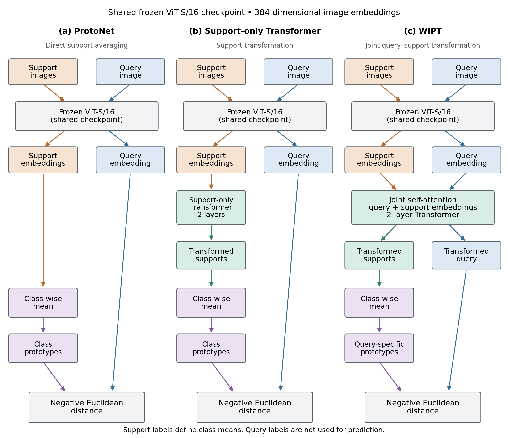

# WIPT: Within-Instance Prototypical Transformer

This is the code for my research project with Tomas Maul, **Query-Conditioned Prototype Adaptation for Cross-Domain Few-Shot Learning: Single-Query Inference, Controlled Comparisons, and Failure Modes**.

The idea behind WIPT is to let the support examples and a query interact before making a prediction. A Transformer processes their image embeddings together, and the transformed support embeddings are averaged into a prototype for each class. The query is assigned to the nearest prototype.

The image encoder stays frozen. Training updates the episodic head, and inference does not update model parameters on the target dataset.

This repository includes the training and evaluation code, saved numerical results, and scripts for generating figures. Dataset images, model checkpoints, and the manuscript are not included.

## Model and tasks

- Encoder: `vit_small_patch16_224.augreg_in21k_ft_in1k` from `timm`, with 384-dimensional embeddings.
- WIPT head: two Transformer layers, six attention heads, and dropout of 0.1.
- Scoring: negative Euclidean distance between the transformed query and class prototypes.
- Comparisons: frozen ProtoNet and a support-only Transformer with matched capacity.
- Episodes: 5 classes, 1 or 5 support images per class, and 15 query images per class.

In the main WIPT setting, each query is processed separately with the supports. The support-only model transforms the supports but leaves the query unchanged. This comparison therefore changes both pathways; it does not isolate the effect of prototype conditioning alone.



## Main results

Mean accuracy (%) across five independently trained heads, using 1,500 matched evaluation episodes per target. ProtoNet has no trained episodic head.

| Shot | Target | ProtoNet | Support-only | WIPT |
|---:|---|---:|---:|---:|
| 1 | CUB | 93.26 | 93.58 | 93.47 |
| 1 | EuroSAT | 62.09 | 63.02 | 64.16 |
| 1 | ISIC | 28.40 | 28.01 | 28.18 |
| 5 | CUB | 97.88 | 97.81 | 97.79 |
| 5 | EuroSAT | 82.76 | 81.46 | 82.04 |
| 5 | ISIC | 38.92 | 37.39 | 38.38 |

The results depend on the dataset and number of support images. WIPT's clearest improvement over ProtoNet is on 1-shot EuroSAT. ProtoNet has the highest mean accuracy in all three 5-shot settings.

The full results and paired comparisons are in `results/raw/training_seed_study/`.

## Repository layout

| Folder | Contents |
|---|---|
| `configs/` | Experiment settings and local paths |
| `models/` | Encoder, WIPT, baselines, and model variants |
| `train/` | Individual training scripts |
| `eval/` | Selected-checkpoint evaluations and benchmarks |
| `experiments/` | Studies across training seeds and follow-up analyses |
| `analysis/` | Result checks and summaries |
| `scripts/` | Dataset preparation, model checks, and figure generation |
| `experimental/` | Optional research extensions outside the reported study |
| `utils/` | Episode sampling, image transforms, metrics, and checkpoint loading |
| `results/` | Saved CSV results |
| `figures/` | Figures and derived statistics |

Run the commands below from the repository root. Each entry point has `--help` for available options.

## Generate figures from the saved results

This is the easiest way to try the repository. It needs Python 3.10 or newer, but no image datasets or model checkpoints.

```bash
python -m pip install -r requirements-analysis.txt
python -m scripts.verify_repository --figures
```

The command checks Python syntax and result tables, then generates eight figures. It does not train a model.

To save figures in another folder:

```bash
python -m scripts.generate_figures --results results --out figures_export --dpi 600
```

Add `--pdf` to export vector PDFs. The script also writes paired statistics, boundary summaries, and rescue/break contributions under the output folder's `derived/` directory.

## Set up the model environment

```bash
python -m venv .venv
# Activate .venv using the command for your shell.
python -m pip install -r requirements.txt
python -m scripts.check_models
```

Use a PyTorch/torchvision build that matches your CPU or CUDA setup. The requirements list the dependencies used by the code; they do not pin the exact original environment.

The model check uses synthetic embeddings and a stub encoder. It does not download ViT weights or check image feature extraction. Creating the pretrained encoder for a real run may download its weights.

Training and evaluation need local datasets. CPU runs are supported, but a GPU is more practical for the full experiments.

## Prepare the datasets

| Dataset | Composition used | Role |
|---|---|---|
| miniImageNet | 100 classes, 600 images per class | Source training, validation, and testing |
| CUB-200-2011 | 200 classes | Fine-grained target |
| EuroSAT | 10 classes, 27,000 images | Satellite target |
| ISIC 2019 | 8 classes, 25,331 images | Skin-lesion target |

The target datasets used in the study came from Kaggle. Exact listing IDs and the image total for the CUB copy are not recorded here.

Arrange the images as class folders:

```text
data/
  miniimagenet_split/
    train/<class>/<image>
    val/<class>/<image>
    test/<class>/<image>
  CUB_200_2011/images/<class>/<image>
  EuroSAT/<class>/<image>
  ISIC/<class>/<image>
```

For miniImageNet, the project sorts the 100 WordNet class IDs and uses the first 64 for training, the next 16 for validation, and the last 20 for testing. This gives 38,400 / 9,600 / 12,000 images. It is a project-specific split, so use this assignment when reproducing the results rather than the usual Ravi–Larochelle split.

For a flat folder of miniImageNet JPGs whose filenames begin with the nine-character WordNet ID:

```bash
python -m scripts.prepare_miniimagenet --source data/miniimagenet --output data/miniimagenet_split
python -m scripts.check_dataset_layout
```

Paths can be changed in `configs/experiment.py` or through supported command-line options. The loader reads images directly inside each class folder, without searching nested folders.

Images are converted to RGB. Evaluation resizes to 256 and centre-crops to 224 × 224. Training uses random resized crops, horizontal flips, and colour jitter of 0.4 for brightness, contrast, and saturation. Both use ImageNet normalization.

Support and query images are distinct within each episode. The main study samples target episodes without target-time parameter updates. Held-out episode classes may still overlap with classes seen during encoder pretraining.

CropDisease and ChestX paths are available for optional extensions, but these datasets are outside the reported three-target study. Use `--include-optional` with the dataset-layout check to include them.

## Train and evaluate the main comparison

```bash
python -m experiments.run_seed_study train --shot 1 --workers 6
python -m experiments.run_seed_study train --shot 5 --workers 6
python -m experiments.run_seed_study clean --shot 1
python -m experiments.run_seed_study clean --shot 5
```

Training uses seeds 0–4, Adam with learning rate `1e-4` and zero weight decay, and cosine annealing to `1e-6`. Each run has up to 50 epochs, with 200 training and 50 validation episodes per epoch. The checkpoint with the best source-validation performance is saved.

Checkpoints go under `checkpoints/seed_study/<shot>shot/seed_<seed>/`. Existing checkpoints are skipped unless `--overwrite` is supplied. Use `--workers 0` when debugging DataLoader problems.

Evaluation uses seeds `42, 123, 2024, 7, 999`, with 300 episodes each. The main paired confidence intervals measure variation across the five training seeds on this fixed episode bank. Episode-level intervals are reported separately. ProtoNet uses the same verified frozen encoder state as the trained heads.

Run `python -m scripts.check_experiment_inputs` to check the required model-evaluation inputs.

## Other experiments

### Multiple queries

```bash
python -m experiments.run_multiquery_study --shot 5 --query-groups 2 3 4 5
python -m experiments.evaluate_multiquery_study --shot 5 --query-groups 1 2 3 4 5
python -m experiments.run_multiquery_study --shot 1 --query-groups 3 5
python -m experiments.evaluate_multiquery_study --shot 1 --query-groups 1 3 5
```

The single-query condition reuses the main checkpoints. Other group sizes have separately trained heads. Queries are shuffled before grouping, and query labels are only used afterwards to check group diversity. The 1-shot sweep is an exploratory follow-up.

### Adaptation and scoring

```bash
python -m experiments.run_factorial_study --shot 5
python -m experiments.evaluate_factorial_study --shot 5
```

This compares adaptation and scorer choices. The Euclidean support-only and WIPT conditions reuse the main checkpoints. The cosine-trained conditions differ from simply switching to cosine scoring at inference.

### Decision changes and corruptions

```bash
python -m experiments.analyze_boundary_all_domains --shots 1 5
python -m experiments.analyze_shot_domain_dependence --shot 1
python -m experiments.analyze_shot_domain_dependence --shot 5
python -m experiments.evaluate_corruption_across_seeds --shot 5
```

The corruption study uses EuroSAT, five independently trained heads, and 1,000 matched episodes per condition. Brightness/contrast, Gaussian noise, and their combination affect both supports and queries.

### Source-shift training

```bash
python -m experiments.run_shift_study --shot 1 --modes shared
python -m experiments.run_shift_study --shot 5 --modes shared
python -m experiments.evaluate_shift_study --shot 1 --modes shared
python -m experiments.evaluate_shift_study --shot 5 --modes shared
```

The mixed-shift follow-up uses `--modes mixed --seeds 0` and has only one training seed. The code also supports `cross` mode, but completed results for that mode are not included.

### Earlier diagnostics and benchmarks

The `eval/` scripts use the root-level checkpoint paths in `configs.experiment.CHECKPOINTS`, which differ from the main seed-study paths.

| Module | Purpose |
|---|---|
| `eval.evaluate_in_domain` | Held-out miniImageNet evaluation |
| `eval.evaluate_cross_domain` | Target accuracy and embedding geometry |
| `eval.evaluate_corruptions` | Earlier corruption evaluation |
| `eval.analyze_query_outcomes` | EuroSAT prediction changes and margins |
| `eval.analyze_support_noise` | Support-pathway diagnostic |
| `eval.evaluate_inference_ablations` | Pooling, scoring, and prototype variants |
| `eval.evaluate_margin_variant` | Margin-trained comparison |

Run these with `python -m <module>`. The support-noise diagnostic keeps the clean transformed query fixed while changing support prototypes. Its results come from one historical model, with five evaluation seeds of 200 episodes each. That checkpoint is not included, and its training seed is unknown.

For head-only timing and memory measurements:

```bash
python -m eval.benchmark_efficiency --shot 1 --output results/raw/efficiency_1shot.csv
python -m eval.benchmark_efficiency --shot 5 --output results/raw/efficiency_5shot.csv
```

These benchmarks use synthetic 384-dimensional embeddings and randomly initialized heads. They exclude image loading and ViT feature extraction. The `backward_*` columns measure forward plus backward time, without the optimizer step. Memory is reported in MiB and includes resident tensors and model parameters.

## Saved results and checkpoints

| Result location | Contents |
|---|---|
| `results/raw/training_seed_study/` | Main comparison across training seeds |
| `results/raw/multiquery/` | Query-group experiments |
| `results/raw/factorial/5shot/` | Adaptation and scoring comparison |
| `results/raw/boundary_all_domains/` | Complete query-level boundary records |
| `results/raw/shot_domain_mechanism/` | Decision-change and geometry summaries |
| `results/raw/shift_study/` | Source-shift experiments |
| `results/paper/` | Earlier selected-checkpoint diagnostics |
| `results/figure_inputs/` | Supplementary plotting inputs |

These folders contain different experiment settings, so their results should be interpreted separately. `results/manifest.csv` lists the earlier selected-checkpoint tables, rather than every experiment. Some checkpoint metadata exports are incomplete and should not be used to count trained heads.

Complete combined result tables are included; duplicate files, temporary restart partitions, and small development outputs are omitted. The figure generator checks 675,000 query records and 12 paired comparisons. Its boundary bins split at zero margin, so they can differ from older binned summaries.

Model weights and datasets are excluded by `.gitignore`. To run model evaluations, retrain the heads or provide compatible checkpoints. You can regenerate the figures directly from the saved CSVs.

Experiment commands can overwrite existing results. Use a separate output directory for new runs if you want to keep the saved records.

The `experimental/` folder contains optional meta-adaptation and alternative-source code. These extensions are outside the reported study. The meta-adaptation branch updates head parameters using target supports, unlike the main WIPT inference procedure.

## Citation and permissions

Author and software metadata are in [CITATION.cff](CITATION.cff). There is no publication DOI or arXiv link listed.

The copyright notice is in [LICENSE](LICENSE). The repository does not currently grant an open-source license.
